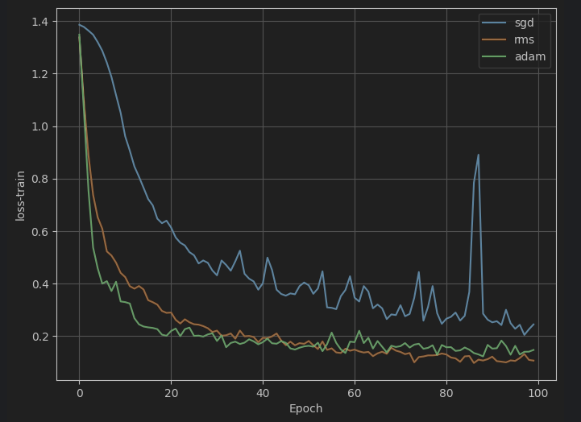
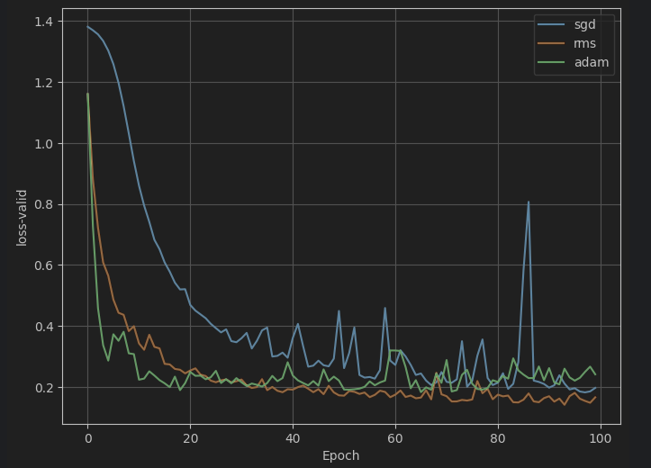

# Design and Train the **Perceptron (MLP)** model with **Mobile price** Dataset

---

## 📊 Dataset Overview

- **Total Samples:** 1000 (approx.)
- **Target Variable:** `price_range`
    - 0 = Low cost
    - 1 = Medium cost
    - 2 = High cost
    - 3 = Very high cost

### 🧩 Features

| Feature         | Description                         |
|-----------------|-------------------------------------|
| `battery_power` | Battery capacity (in mAh)           |
| `blue`          | Bluetooth support (0 = No, 1 = Yes) |
| `clock_speed`   | Processor clock speed (GHz)         |
| `dual_sim`      | Dual SIM support (0/1)              |
| `fc`            | Front camera (MP)                   |
| `four_g`        | 4G support (0/1)                    |
| `int_memory`    | Internal memory (in GB)             |
| `m_dep`         | Mobile depth/thickness (in cm)      |
| `mobile_wt`     | Weight of mobile (grams)            |
| `n_cores`       | Number of processor cores           |
| `pc`            | Primary camera (MP)                 |
| `ram`           | RAM capacity (in MB)                |
| `sc_h`, `sc_w`  | Screen height & width (in pixels)   |
| `talk_time`     | Talk time (hours)                   |
| `three_g`       | 3G support (0/1)                    |
| `wifi`          | Wi-Fi support (0/1)                 |
| `price_range`   | Target class (0 to 3)               |

---

## 🎯 Objective

To classify mobile phones into one of four **price ranges** based on the given technical specifications.

---

## Selected the best Larning rate and the wight decay based on optimizer

* SGD:
    - Larning rate: 0.3
    - Weight decay: 0.0
* RMSprop:
    - Larning rate: 0.01
    - Weight decay: 0.0
* Adam:
    - Larning rate: 0.1
    - Weight decay: 1e-6

---

* Loss function: CrossEntropyLoss

---

## Compare the results:

### Loss Train:

### Loss Valid:

### Accuracy Train:

### Accuracy Valid:

